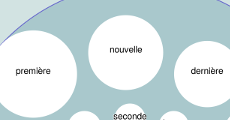

# ClusterCat: Fast, Flexible Word Clustering Software

## Overview

ClusterCat induces word classes from unannotated text.
It is programmed in modern C, with no external libraries.
A Python wrapper is also provided.

Word classes are unsupervised part-of-speech tags, requiring no manually-annotated corpus.
Words are grouped together that share syntactic/semantic similarities.
They are used in many dozens of applications within natural language processing, machine translation, neural net training, and related fields.

## Installation
### Linux
You can use either GCC 4.6+ or Clang 3.7+, but GCC is recommended.

      sudo apt-get update  &&  sudo apt-get install gcc make
      make -j 4

### macOS / OSX
The current version of Clang in Xcode doesn't fully support [OpenMP][], so instead install GCC from [Homebrew][]:

      brew update  &&  brew install gcc@7  &&  xcode-select --install
      make -j 4 CC=/usr/local/bin/gcc-7

## Commands
The binary program `clustercat` gets compiled into the `bin` directory.

**Clustering** preprocessed text (already tokenized, normalized, etc) is pretty simple:

      bin/clustercat [options] < train.tok.txt > clusters.tsv

The word-classes are induced from a bidirectional [predictive][] [exchange algorithm][].
The format of the output class file has each line consisting of `word`*TAB*`class` (a word type, then tab, then class).

Command-line argument **usage** may be obtained by running with program with the **`--help`** flag:

      bin/clustercat --help

## Python
Installation and usage details for the Python module are described in a separate [readme](python/README.md).

## Features
- Print **[word vectors][]** (a.k.a. word embeddings) using the `--word-vectors` flag.  The binary format is compatible with word2vec's tools.
- Start training using an **existing word cluster mapping** from other clustering software (eg. mkcls) using the `--class-file` flag.
- Adjust the number of **threads** to use with the `--threads` flag.  The default is 8.
- Adjust the **number of clusters** or vector dimensions using the `--classes` flag. The default is approximately the square root of the vocabulary size.
- Includes **compatibility wrapper script ` bin/mkcls `** that can be run just like mkcls.  You can use more classes now :-)

## Comparison
| Training Set                                        | [Brown][] | ClusterCat | [mkcls][] | [Phrasal][] | [word2vec][] |
| ------------                                        | --------- | ---------- | --------- | ----------- | ------------ |
| 1 Billion English tokens,   800 clusters  | 12.5 hr   | **1.4** hr | 48.8 hr   | 5.1 hr      | 20.6 hr      |
| 1 Billion English tokens,   1200 clusters | 25.5 hr   | **1.7** hr | 68.8 hr   | 6.2 hr      | 33.7 hr      |
| 550 Million Russian tokens, 800 clusters  | 14.6 hr   | **1.5** hr | 75.0 hr   | 5.5 hr      | 12.0 hr      |

## Visualization
See [bl.ocks.org][] for nice data visualizations of the clusters for various languages, including English, German, Persian, Hindi, Czech, Catalan, Tajik, Basque, Russian, French, and Maltese.

For example:

 
 
 

You can generate your own graphics from ClusterCat's output.
Add the flag  `--print-freqs`  to ClusterCat, then type the command:

      bin/flat_clusters2json.pl --word-labels < clusters.tsv > visualization/d3/clusters.json

You can either upload the [JSON][] file to [gist.github.com][], following instructions on the [bl.ocks.org](http://bl.ocks.org) front page, or you can view the graphic locally by running a minimal webserver in the `visualization/d3` directory:

      python -m SimpleHTTPServer 8116 2>/dev/null &

Then open a tab in your browser to [localhost:8116](http://localhost:8116) .

The default settings are sensible for normal usage, but for visualization you probably want much fewer word types and clusters -- less than 10,000 word types and 120 clusters.
Your browser will thank you.

## Perplexity
The perplexity that ClusterCat reports uses a bidirectional bigram class language model, which is richer than the unidirectional bigram-based perplexities reported by most other software.
Richer models provide a better evaluation of the quality of clusters, having more sensitivity (power) to detect improvements.
If you want to directly compare the quality of clusters with a different program's output, you have a few options:

1. Load another clustering using `--class-file` , and see what the other clustering's initial bidirectional bigram perplexity is before any words get exchanged.
2. Use an external class-based language model.  These are usually two-sided (unlexicalized) models, so they favor two-sided clusterers.
3. Evaluate on a downstream task.  This is best.

## Contributions
Contributions are welcome, via [pull requests][].

## Citation
If you use this software please cite the following

Dehdari, Jon, Liling Tan, and Josef van Genabith. 2016. [BIRA: Improved Predictive Exchange Word Clustering](http://www.aclweb.org/anthology/N16-1139.pdf).
In *Proceedings of the 2016 Conference of the North American Chapter of the Association for Computational Linguistics: Human Language Technologies (NAACL)*, pages 1169–1174, San Diego, CA, USA.  Association for Computational Linguistics.

    @inproceedings{dehdari-etal2016,
     author    = {Dehdari, Jon  and  Tan, Liling  and  van Genabith, Josef},
     title     = {{BIRA}: Improved Predictive Exchange Word Clustering},
     booktitle = {Proceedings of the 2016 Conference of the North American Chapter of the Association for Computational Linguistics: Human Language Technologies (NAACL)},
     month     = {June},
     year      = {2016},
     address   = {San Diego, CA, USA},
     publisher = {Association for Computational Linguistics},
     pages     = {1169--1174},
     url       = {http://www.aclweb.org/anthology/N16-1139.pdf}
    }

[lgpl3]: https://www.gnu.org/copyleft/lesser.html
[mpl2]: https://www.mozilla.org/MPL/2.0
[c99]: https://en.wikipedia.org/wiki/C99
[homebrew]: http://brew.sh
[openmp]: https://en.wikipedia.org/wiki/OpenMP
[predictive]: https://www.aclweb.org/anthology/P/P08/P08-1086.pdf
[exchange algorithm]: http://citeseerx.ist.psu.edu/viewdoc/summary?doi=10.1.1.53.2354
[brown]: https://github.com/percyliang/brown-cluster
[mkcls]: https://github.com/moses-smt/mgiza
[phrasal]: https://github.com/stanfordnlp/phrasal
[word2vec]: https://code.google.com/archive/p/word2vec/
[word vectors]: https://en.wikipedia.org/wiki/Word_embedding
[bl.ocks.org]: http://bl.ocks.org/jonsafari
[JSON]: https://en.wikipedia.org/wiki/JSON
[gist.github.com]: https://gist.github.com
[pull requests]: https://help.github.com/articles/creating-a-pull-request
